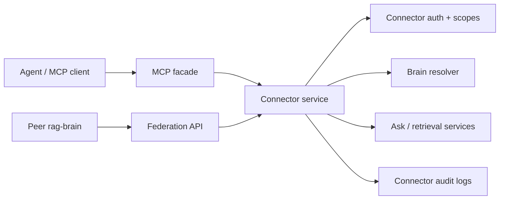

# rag-brain Connectors Design

## Goal

Add an MCP-style connect point for `rag-brain` that also lets duplicated `rag-brain`
instances discover and query each other. The connector system should sit between
admin-only APIs and public website tokens: more capable than the widget token,
but still scoped, auditable, and safe to hand to trusted tools, servers, and peer
brains.

## Current Context

`rag-brain` already has:

- Per-brain public website tokens stored hashed in `brain_profiles.public_token_hash`.
- Dynamic CORS for public website origins allowlisted on the brain profile.
- Public ask endpoint at `/api/ai/public/{slug}/ask`.
- Admin API protection through `X-Admin-Api-Key`.
- A Connect wizard that creates public website embeds and verifies the public ask path.
- Brain profiles for purpose, audience, personality, tone, confidence target,
  disclaimer, public mode, and allowed domains.

The connector layer must not reuse public website tokens. Public tokens are
browser-facing and intentionally narrow. Connector credentials are for trusted
tools and server-side callers, and need their own scopes, lifecycle, and logs.

## Recommended Architecture

Build one connector foundation with two exposed faces:

1. **MCP-compatible tools** for agents and coding assistants.
2. **Federation APIs** for one `rag-brain` instance to discover and query another.

Both faces use the same connector client records, token validation, scope checks,
and audit logging.



## Connector Clients

Add a `brain_connector_clients` table. A connector client can be scoped to one
brain or allowed across all active brains.

Fields:

- `id`
- `name`
- `type`: `MCP_AGENT`, `PEER_BRAIN`, `SERVER_API`, `INTERNAL_APP`
- `brain_id`: nullable; null means instance-level client
- `token_hash`
- `scopes`: JSON array of scope strings
- `allowed_origins`: JSON array for browser-capable connector clients
- `allowed_peer_hosts`: JSON array for peer-to-peer server calls
- `enabled`
- `last_used_at`
- `created_at`
- `updated_at`

Token format:

```text
rb_conn_<random>
```

Tokens are shown once at generation time and stored hashed with SHA-256, matching
the public-token operational model.

## Scopes

The MVP scope set is intentionally small:

- `brains:list`
- `brain:read`
- `ask:public`
- `retrieve:public`
- `citations:read`
- `readiness:read`

Deferred scopes:

- `ingest:url`
- `ingest:file`
- `sources:list`
- `admin:settings`
- `admin:prompts`

No connector client receives admin mutation scopes in the MVP. Admin API key
continues to protect dashboard/admin workflows.

## Discovery Manifest

Expose a public, no-secret discovery document:

```text
GET /.well-known/rag-brain.json
```

Response shape:

```json
{
  "protocol": "rag-brain-connect",
  "version": "1.0",
  "instanceId": "local-or-configured-instance-id",
  "name": "rag-brain",
  "brains": [
    {
      "slug": "generic",
      "displayName": "Generic Brain",
      "active": true
    }
  ],
  "endpoints": {
    "federation": "/api/connect/v1",
    "mcp": "/mcp"
  },
  "capabilities": [
    "brains:list",
    "brain:read",
    "ask:public",
    "retrieve:public",
    "citations:read",
    "readiness:read"
  ]
}
```

The manifest must not reveal connector tokens, admin settings, private source
counts, traces, local filesystem paths, S3 bucket names, or local model endpoints.

## Federation API

Expose server-to-server endpoints under:

```text
/api/connect/v1
```

Authentication:

```text
Authorization: Bearer rb_conn_...
```

MVP endpoints:

- `GET /api/connect/v1/brains`
- `GET /api/connect/v1/brains/{slug}`
- `POST /api/connect/v1/brains/{slug}/ask`
- `POST /api/connect/v1/brains/{slug}/retrieve`
- `GET /api/connect/v1/brains/{slug}/readiness`

Federation ask uses the public-safe answer contract. It can retrieve only
`PUBLIC` sources and must not expose trace IDs, internal notes, admin settings,
private paths, or non-public source content.

Federation retrieve returns ranked public chunks and citation metadata, not raw
internal trace objects.

## MCP Facade

The MCP facade should expose tools backed by the same connector services:

- `rag_brain_list_brains`
- `rag_brain_readiness`
- `rag_brain_ask`
- `rag_brain_retrieve`

The first implementation can be an HTTP JSON facade with MCP-shaped tool names
and schemas. A full MCP transport can follow once the connector service and
contracts are stable.

Tool calls require a connector bearer token. Tools must enforce the same scopes
as federation endpoints.

## Dashboard Experience

Add a `Connectors` admin screen separate from the website `Connect` wizard.

Admin workflows:

- List connector clients.
- Create connector client with name, type, optional brain, and scope selection.
- Rotate token and show it once.
- Disable or enable a connector.
- View last-used time and recent connector audit rows.
- Copy snippets for:
  - MCP agent configuration.
  - Federation ask call.
  - Peer `rag-brain` registration.

The existing `Connect` wizard remains focused on website/app embeds.

## Audit And Observability

Add `brain_connector_events` table:

- `id`
- `connector_client_id`
- `brain_id`
- `event_type`: `AUTH_SUCCESS`, `AUTH_FAILURE`, `ASK`, `RETRIEVE`, `READINESS`
- `scope`
- `request_host`
- `request_id`
- `status`
- `created_at`

Connector logs should not store raw prompts by default in the MVP. They should
store enough metadata for security review and troubleshooting.

## Security Rules

- Public website tokens remain separate from connector tokens.
- Connector tokens are never stored in plaintext.
- Disabled connector clients are rejected.
- Missing, invalid, or disabled connector credentials return `401`.
- Valid credential with missing scope returns `403`.
- Connector requests can only use public-safe retrieval and public-safe answer
  contracts in the MVP.
- Discovery manifest is public but contains no secrets or infrastructure-sensitive
  values.
- Admin mutation remains behind `X-Admin-Api-Key`.

## MVP Cut

Implement first:

1. Database schema for connector clients and events.
2. Connector token generation and validation service.
3. Admin API for connector clients.
4. Discovery manifest.
5. Federation list/readiness/ask/retrieve endpoints.
6. Dashboard Connectors screen with snippets.
7. Tests and docs.

Defer:

- URL ingestion through connectors.
- Full bidirectional sync between rag-brain instances.
- Signed JWT/OAuth connector credentials.
- Streaming MCP transport.
- Connector-scoped rate limits beyond existing global public rate limiting.

## Success Criteria

- An admin can create a connector for one brain and copy a token.
- A server can call the federation ask endpoint with that token and receive a
  public-safe answer with citations.
- A connector without `ask:public` cannot call ask.
- A peer instance can discover the manifest without credentials.
- A connector event is written for successful and rejected connector calls.
- Existing public website tokens and admin API behavior continue to work.
